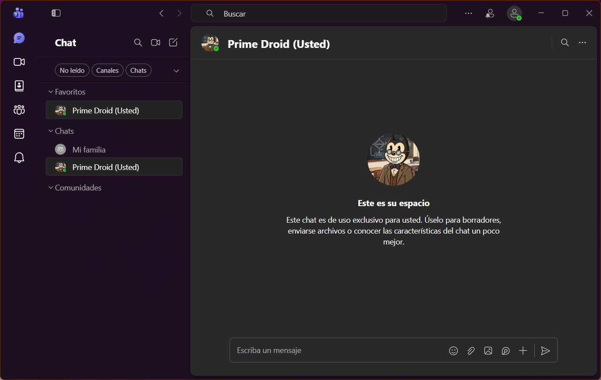

[TOC]

# Cómo acceder a Microsoft Teams gratuito

Para usar Teams necesitas una cuenta de Microsoft. Puedes usar una que ya tengas (opción A) o crear una nueva (opción B).

> [!important]
> Las instrucciones siguientes reflejan la idea general. Los pasos literales pueden cambiar ligeramente con actualizaciones constantes del se.

## Opción A — Ya tienes cuenta de Microsoft

Tienes cuenta de Microsoft si usas alguno de estos servicios:
- 📧 Correo Hotmail, Outlook o Live
- 🎮 Xbox
- ☁️ OneDrive personal
- 🪟 Microsoft 365

**Pasos:**

1. Ve a [teams.microsoft.com](teams.microsoft.com)

2. Haz clic en **Iniciar sesión**

3. Introduce tu correo y contraseña de Microsoft

   > [!caution]
   >
   > También puede pedirte algún método adicional de autenticación. Sigue las instrucciones que te digan.

4. Si Teams te pregunta para qué vas a usarlo, selecciona **Para uso personal**

5. Ya estás dentro

## Opción B — No tienes cuenta de Microsoft

Puedes crear una cuenta gratis con cualquier correo (Gmail, Yahoo, etc.) o crear un correo nuevo de Outlook.

**Pasos:**

1. Ve a [teams.microsoft.com](teams.microsoft.com)

2. Haz clic en **Registrarse gratis**

3. Introduce tu dirección de correo y haz clic en **Siguiente**

4. Elige una contraseña (mínimo 8 caracteres, con algún número y mayúscula)

5. Microsoft te enviará un código de verificación a tu correo — ábrelo
   y cópialo en la pantalla de Teams

   

   > [!warning]
   >
   > Si no ves el email, revisa la carpeta de spam o correo no deseado

6. Introduce tu nombre y apellido

7. Selecciona **Para uso personal** cuando pregunte para qué vas a usar Teams

8. Ya estás dentro

## Una vez dentro

En la barra lateral izquierda encontrarás las secciones principales:

- **Chat** — mensajes directos con otras personas
- **Equipos** — grupos y canales de clase o trabajo
- **Llamadas** — videollamadas y llamadas de voz
- **Actividad** — notificaciones y menciones recientes

{.rounded-3}

> [!tip]
>
> 💻 Si Teams te ofrece instalar la aplicación de escritorio, puedes hacerlo o elegir **Usar la aplicación web** para seguir desde el navegador sin instalar nada. 
>
> 📱 También puedes instalar la aplicación móvil desde la tienda de [Android](https://play.google.com/store/apps/details?id=com.microsoft.teams) o [Apple](https://apps.apple.com/es/app/microsoft-teams/id1113153706).

